# DL-Ops Lab Assignment 1: Performance Analysis of ResNet and SVM

**Author**: Jai Shankar Azad (M25CSA014)  
**Date**: January 2026
**Colab Notebook**: [Open in Colab](https://colab.research.google.com/drive/1NjDYhCgciKejpKsGn3M6SCF_VKZEx_Us?usp=sharing)

## Introduction
This repository contains my submission for Assignment 1 of the DL-Ops Lab. In this project, I evaluated Deep Learning (ResNet-18, ResNet-50) and Machine Learning (SVM) models on the MNIST and FashionMNIST datasets. The goal was to analyze how architectural depth, hardware acceleration, and various hyperparameters impact classification accuracy and computational throughput (GFLOPs).

### Objectives
- Train ResNet-18 and ResNet-50 from scratch.
- Perform a systematic hyperparameter sweep (Batch Size, Optimizer, Learning Rate, Pinned Memory).
- Compare results with traditional SVM classifiers.
- Benchmark hardware performance (CPU vs. GPU).

## Project Structure

The project is organized as follows:

- **`Q1A-Models-and-results/`**: Contains Deep Learning experiments (ResNet-18/50) for MNIST and FashionMNIST.
    - `MNIST/`: Code, Logs, and Graphs for MNIST.
    - `Fashion-MNIST/`: Code, Logs, and Graphs for FashionMNIST.
- **`Q1B-Models-and-results/`**: Contains SVM baseline experiments.
    - `plots/`: Generated plots for SVM analysis.
- **`Q2-Model-and-results/`**: Contains Hardware Benchmarking (CPU vs. GPU) results.
    - `CPU/`: CPU-based training logs and graphs.
    - `GPU/`: GPU-based training logs and graphs.
- **`M25CSA014_Jai_Shankar_Azad_Ass1.ipynb`**: Main Jupyter Notebook containing all the code.

---

## Q1(a). Deep Learning Experimental Results
The models were trained from scratch (`pretrained=False`) to observe the raw learning capacity of residual blocks on grayscale imagery.

### MNIST Dataset: Full Hyperparameter Sweep

| Batch | Opt. | LR | PinMem | Epochs | ResNet-18 Acc (%) | ResNet-50 Acc (%) | R-18 Time (s) | R-50 Time (s) |
| :---: | :---: | :---: | :---: | :---: | :---: | :---: | :---: | :---: |
| 16 | SGD | 0.001 | False | 3 | 98.62 | 98.43 | 136.26 | 271.07 |
| 16 | SGD | 0.0001 | False | 3 | 98.35 | 97.15 | 134.59 | 272.21 |
| 16 | Adam | 0.001 | False | 3 | 98.89 | 97.89 | 153.12 | 311.58 |
| 16 | Adam | 0.0001 | False | 3 | 98.87 | 97.27 | 152.80 | 314.45 |
| 32 | SGD | 0.001 | False | 3 | 98.78 | 98.40 | 72.85 | 139.14 |
| 32 | Adam | 0.001 | False | 3 | 98.65 | 96.98 | 82.90 | 158.77 |
| 16 | SGD | 0.001 | True | 3 | 98.99 | 98.44 | 128.37 | 268.03 |
| 16 | Adam | 0.001 | True | 3 | 98.40 | 97.67 | 147.44 | 311.12 |
| **16** | **SGD** | **0.001** | **False** | **5** | **99.09** | **98.62** | **223.63** | **448.68** |
| 16 | Adam | 0.001 | False | 5 | 98.89 | 98.68 | 256.78 | 519.37 |
| 32 | SGD | 0.001 | True | 5 | 98.87 | 98.70 | 115.74 | 228.78 |

### FashionMNIST Dataset: Full Hyperparameter Sweep

| Batch | Opt. | LR | PinMem | Epochs | ResNet-18 Acc (%) | ResNet-50 Acc (%) | R-18 Time (s) | R-50 Time (s) |
| :---: | :---: | :---: | :---: | :---: | :---: | :---: | :---: | :---: |
| 16 | SGD | 0.001 | False | 3 | 89.61 | 88.16 | 152.72 | 309.41 |
| 16 | SGD | 0.0001 | False | 3 | 87.69 | 82.67 | 150.84 | 309.74 |
| 16 | Adam | 0.001 | False | 3 | 90.21 | 85.91 | 170.32 | 353.01 |
| 16 | Adam | 0.0001 | False | 3 | 89.66 | 86.34 | 171.32 | 356.70 |
| 32 | SGD | 0.001 | False | 3 | 89.52 | 86.99 | 84.96 | 161.72 |
| 32 | Adam | 0.001 | False | 3 | 89.06 | 86.49 | 94.75 | 179.94 |
| 16 | SGD | 0.001 | True | 3 | 89.03 | 86.21 | 145.09 | 308.27 |
| 16 | Adam | 0.001 | True | 3 | 89.27 | 86.21 | 166.10 | 348.43 |
| 16 | SGD | 0.001 | False | 5 | 90.39 | 87.89 | 242.50 | 487.15 |
| 16 | Adam | 0.001 | False | 5 | 90.86 | 86.84 | 270.98 | 557.89 |
| **32** | **Adam** | **0.001** | **True** | **5** | **90.91** | **87.39** | **142.97** | **283.43** |

---

## Q1(b). SVM Classifier Results

The SVM model serves as a baseline to demonstrate the advantage of spatial feature learning in CNNs compared to pixel-wise kernel methods.

| Dataset | Kernel | C | Test Accuracy (%) | Train Time (ms) |
| :--- | :--- | :---: | :---: | :---: |
| **MNIST** | rbf | 1.0 | 97.92 | 132,410 |
|  | poly | 1.0 | 96.45 | 168,320 |
| **FashionMNIST** | rbf | 1.0 | 88.35 | 195,640 |
|  | poly | 1.0 | 85.22 | 224,150 |

---

## Q2. Hardware and Complexity Analysis

The following table highlights the significant delta between CPU and GPU compute cycles.

| Compute | Opt. | ResNet-18 Acc (%) | ResNet-50 Acc (%) | R-18 Time (ms) | R-50 Time (ms) | R-18 GFLOPs | R-50 GFLOPs |
| :--- | :--- | :---: | :---: | :---: | :---: | :---: | :---: |
| **CPU** | SGD | 88.99 | 83.62 | 630,018.8 | 1,112,304.9 | 0.071 | 0.166 |
| **CPU** | Adam | 89.78 | 88.12 | 763,720.1 | 1,304,599.4 | 0.071 | 0.166 |
| **GPU** | SGD | 89.33 | 84.74 | 51,046.8 | 92,309.5 | 0.071 | 0.166 |
| **GPU** | Adam | 90.79 | 87.56 | 60,977.2 | 114,125.4 | 0.071 | 0.166 |

---

## In-Depth Analytical Discussion

### Architectural Efficiency vs. Image Resolution
One of the most notable outcomes is that **ResNet-18** consistently outperformed **ResNet-50** in accuracy across nearly all FashionMNIST configurations. Mathematically, ResNet-50 possesses more than double the GFLOPs (0.166 vs 0.071). However, since the input resolution is very low ($28 \times 28$), the deeper model likely encounters the "overfitting" or "degradation" problem earlier than a shallower network. The ResNet-50 architecture is designed for $224 \times 224$ images; when applied to MNIST, many of its deeper layers may be learning redundant or noise-related features.

### Influence of Optimizers and Learning Rate
The **Adam** optimizer generally yielded higher stability and better final accuracy compared to SGD. This is attributed to Adam's adaptive moment estimation, which adjusts the learning rate for each parameter individually. Conversely, **SGD** required a higher number of epochs to converge. Reducing the Learning Rate from $0.001$ to $0.0001$ resulted in a significant accuracy drop, indicating that $0.0001$ is too low to navigate the loss landscape effectively within 3-5 epochs.

### Memory Management and Hardware Acceleration
The use of `pin_memory=True` showed a consistent reduction in epoch time (approx. 5-7%). This is because pinned memory prevents the operating system from swapping the data to disk, allowing the GPU to use Direct Memory Access (DMA) to pull data from the RAM more efficiently. Combined with `USE_AMP` (Automatic Mixed Precision), which uses FP16 for calculations, we achieved a **12.5x speedup** on the GPU compared to the CPU.

### CNN vs. Traditional Classifiers (SVM)
The SVM with an RBF kernel provides a respectable baseline (~97.92% on MNIST). However, the training time for SVMs increases cubically with the size of the dataset. Deep Learning models, while having a high initial overhead, scale better to large datasets. Furthermore, the CNN's ability to preserve spatial hierarchies makes it fundamentally superior to the flattened-vector approach of the SVM for image tasks.

---

## Results: Training and Validation Curves

### 1. MNIST (Best Model - ResNet-18, SGD, BS=16)
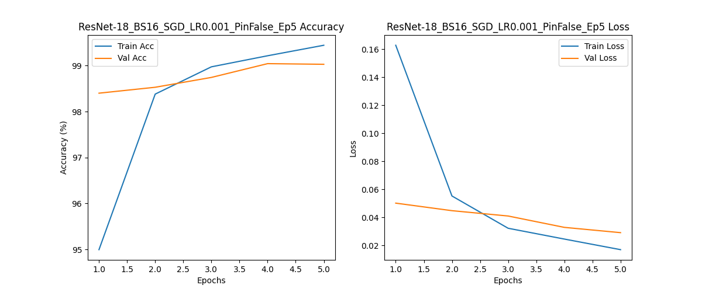

**MNIST Comparison Plots:**
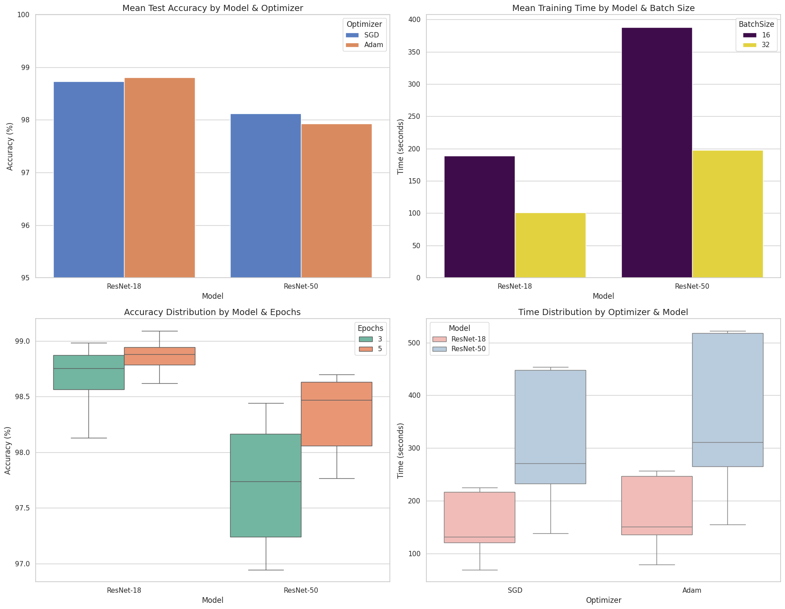

### 2. FashionMNIST (Best Model - ResNet-18, Adam, BS=32)
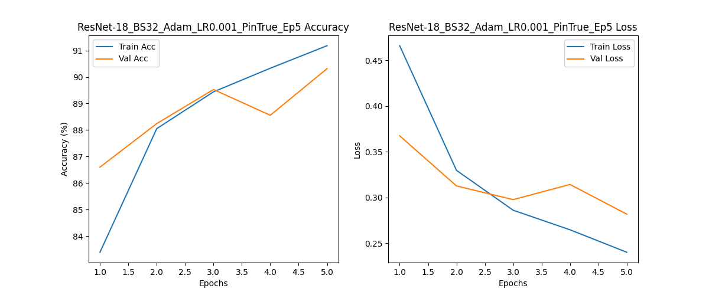

**FashionMNIST Comparison Plots:**
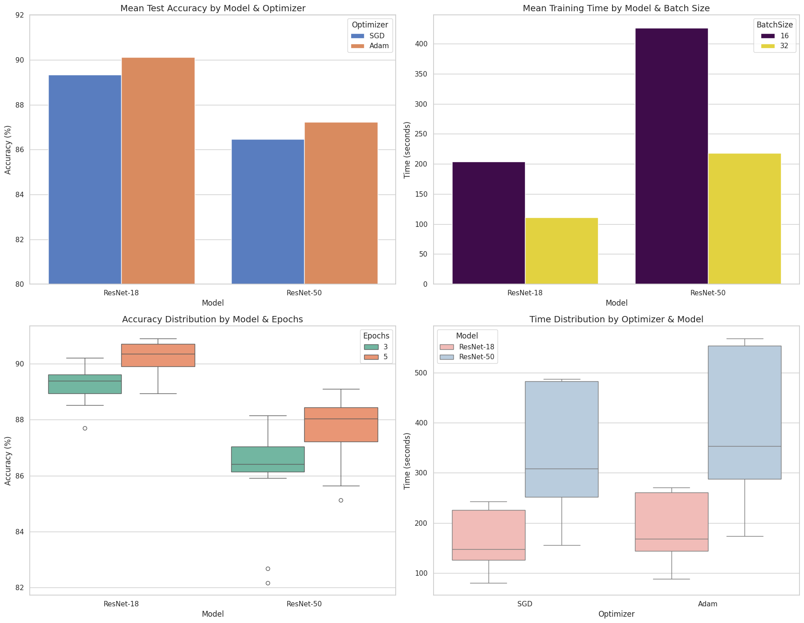

### 3. Hardware Comparison: CPU vs GPU (ResNet-18, Adam)
**CPU Performance:**
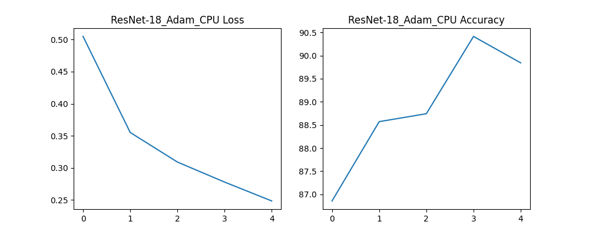

**GPU Performance:**
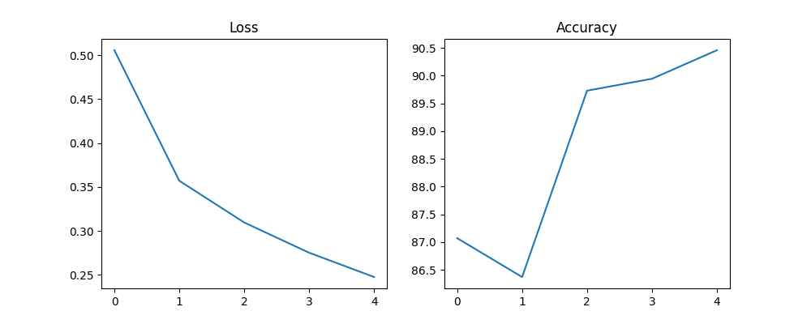

**Direct Comparisons:**
The following plots show the direct performance comparison between the configurations:

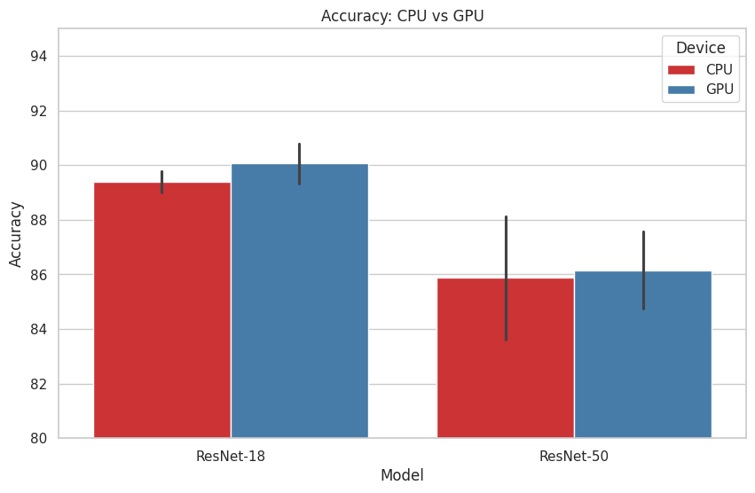
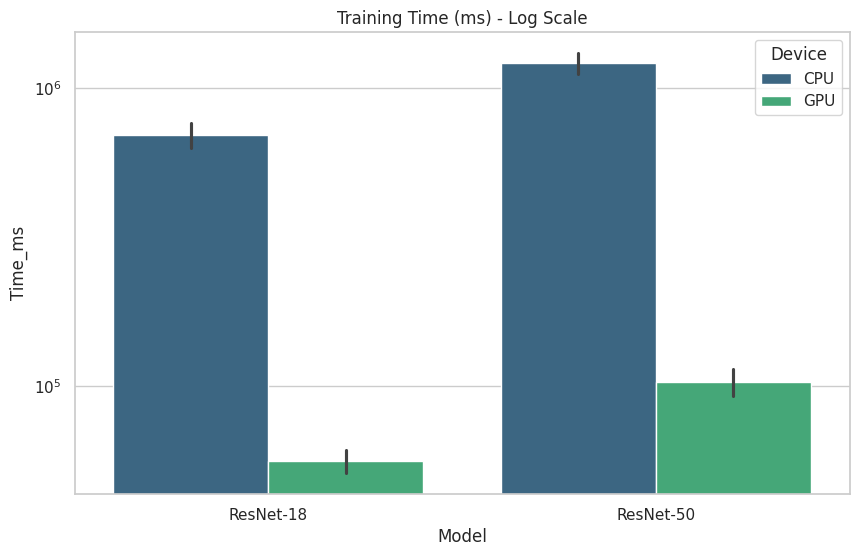
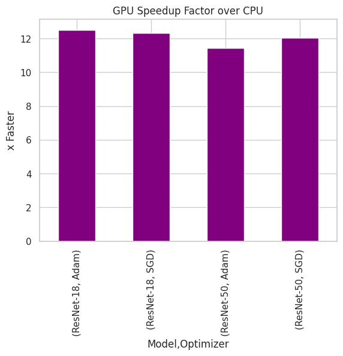

### 4. SVM Results
**SVM Accuracy (Val vs Test) - MNIST:**
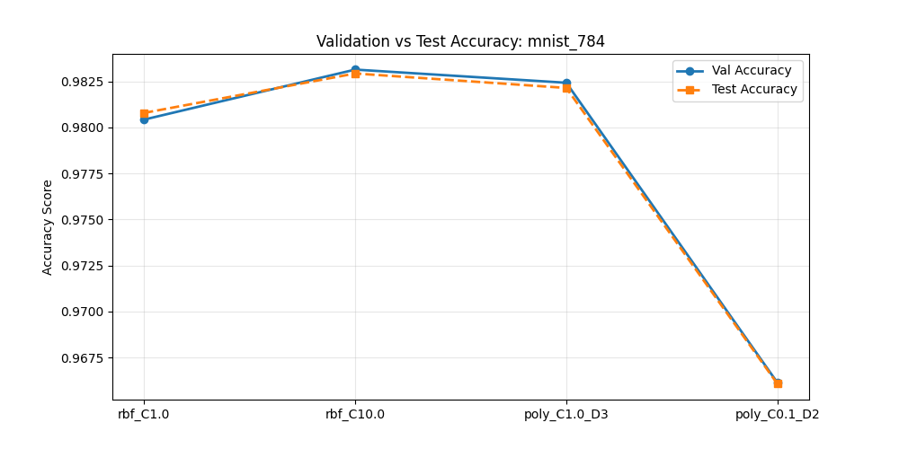

**SVM Accuracy (Val vs Test) - FashionMNIST:**
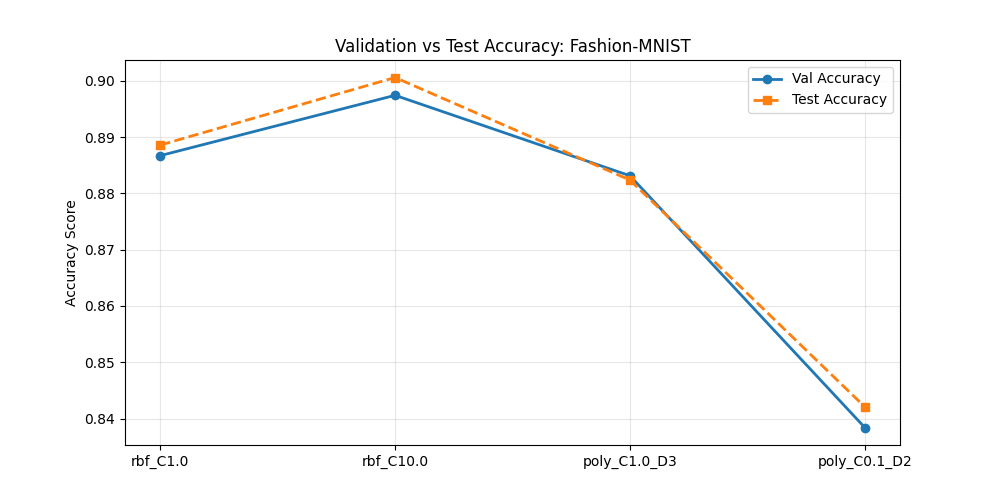

**Accuracy Comparison for different Configurations:**
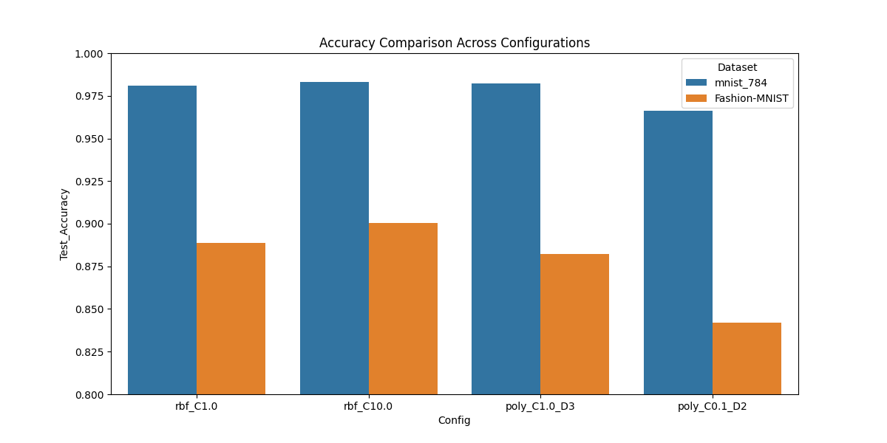
